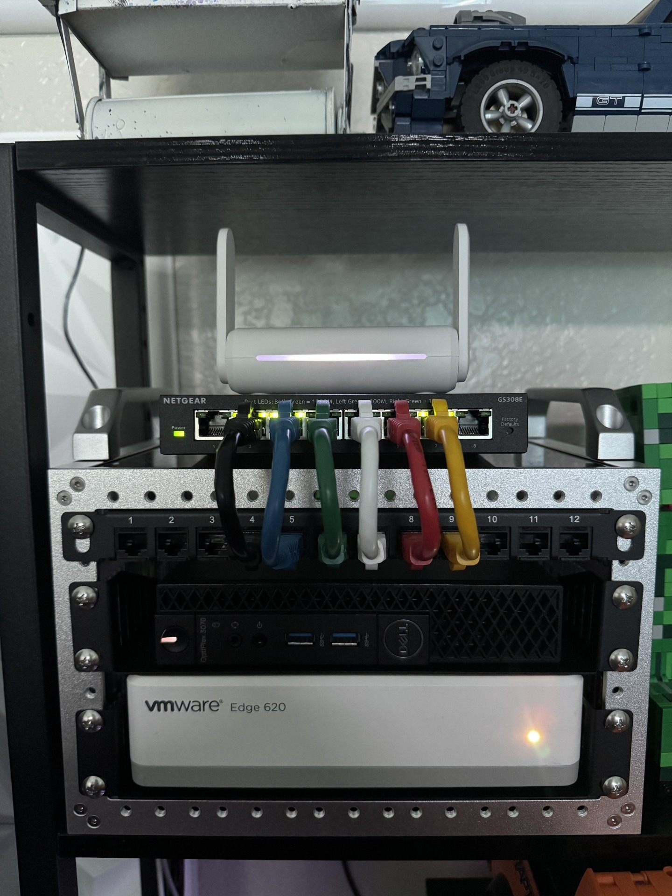

# Homelab — Segmented Network Security Environment

A self-built, self-funded homelab designed to learn networking and security concepts hands-on — not a class assignment, but a real environment I run, monitor, and continue to harden.



## Why I built this

My room has WiFi but no Ethernet drop. Rather than solve that with a cheap mesh extender, I used it as an excuse to build something that mirrors small-scale enterprise network design: a WiFi-to-Ethernet bridge feeding a real firewall, a managed switch, and a segmented VLAN architecture where every packet from every device passes through one firewall under my control.

## Architecture

```
Internet → ISP Router → WiFi → Bridge → OPNsense (firewall/router) → Managed Switch → VLANs
```

- **Hypervisor:** Proxmox VE on a Dell OptiPlex Micro, host itself pinned to the Management VLAN (never placed on the isolated Lab VLAN, so a compromised lab VM can't reach or control the hypervisor)
- **Firewall/Router:** OPNsense, default-deny between VLANs
- **Segmentation (4 VLANs):**
  - Management — infrastructure devices (OPNsense, switch, Proxmox host)
  - Servers — always-on VMs (DNS, monitoring, jump box)
  - DMZ — anything that must be internet-reachable, isolated from everything else
  - Lab — fully isolated attack range (Kali, Metasploitable), blocked from reaching any other VLAN or the internet
- **DNS:** Pi-hole, centralized across all VLANs, with DNSSEC and DNS-over-TLS to Cloudflare/Google
- **Remote access:** WireGuard VPN, full-tunnel, own dedicated subnet
- **Intrusion detection:** Suricata IDS/IPS inline on the firewall, multiple active rulesets, auto-updating daily
- **Bastion host:** a single hardened jump box is the only server reachable from the public internet — everything else sits behind it
- **Monitoring:** Grafana + Prometheus, plus NUT for UPS/power monitoring
- **Reverse proxy:** Nginx in front of self-hosted and DMZ services

*(Complete config reference in [`/docs`](./docs).)*

## Key design decisions

- **VLAN segmentation over a flat network** — a compromise on one VLAN shouldn't automatically mean a compromise everywhere. The Lab VLAN in particular is fully isolated so anything run there (deliberately vulnerable VMs, attack tools) can't reach production services at all.
- **A DMZ for anything public-facing** — the one production service that needs to be reachable from the internet lives on its own VLAN, isolated from Management, Servers, and Lab. If it's ever compromised, the blast radius stops there.
- **A single bastion host instead of exposing services directly** — external access goes through one hardened jump box rather than opening multiple internal boxes to the internet.
- **Defense in depth, not defense in one place** — the biggest lesson from this project: a router-level firewall (OPNsense) only sees traffic that actually crosses the router. Two devices on the *same* VLAN talk directly at Layer 2 and are completely invisible to it. A host-level firewall (ufw) is the only thing that closes that gap — real segmentation needs both layers, because each is blind to exactly what the other covers.

## Problems I hit and how I fixed them

**Firewall rule I wrote wasn't actually working — and the reason why was the real lesson.**
I added an OPNsense rule blocking the jump box from reaching other internal hosts, expecting it to stop it from reaching another server on the same VLAN. It didn't — pings to that server kept succeeding. Watching the firewall's live traffic log showed why: a ping to an outside address (crossing the router) showed up in the log, but the same-VLAN ping never did. Same-subnet traffic switches at Layer 2 and never reaches the firewall to be evaluated — router rules structurally can't see it. The real fix had to be host-based: installed `ufw` directly on the jump box with explicit deny rules for every internal subnet. Verified after: same-VLAN ping 100% blocked, internet ping 100% blocked, but the box's own local service still responded fine.

**WireGuard handshake succeeded but no traffic passed.**
The tunnel established (handshake confirmed) but pings timed out. OPNsense doesn't pass traffic just because a VPN interface exists — a firewall rule was missing entirely for the WireGuard group interface. Added an explicit pass rule for the VPN subnet, and traffic started flowing immediately.

**A security setting I thought was permanent had silently reverted.**
During an unrelated check, a log showed SSH accepting password logins on a box I'd locked to key-only auth weeks earlier. Root cause: a drop-in config file (loaded automatically by cloud-init) re-enabled password auth, and drop-in files load *after* — and override — the main config. The fix wasn't just re-disabling it; it was learning to verify security settings with the tool's own merged-config output instead of trusting a file I'd edited once and never rechecked.

**UPS monitoring kept failing after real power events.**
After an actual power flicker, the kernel's generic USB driver kept claiming the UPS's USB device before the monitoring service could. Fixed permanently with a custom systemd service that unbinds the device from the kernel, waits, rebinds it, then fixes socket permissions — all before the monitoring service starts.

**Double NAT complicated remote access.**
My WiFi-to-Ethernet bridge sits between the ISP router and OPNsense, meaning port forwarding had to be configured at two separate layers before any external access worked.

## What's next

- Direct Ethernet run to eliminate the double-NAT entirely
- Extend Suricata's visibility to the DMZ (currently WAN-only, so a compromised DMZ box calling out wouldn't be seen)
- Keep re-verifying hardening settings with merged config output rather than trusting a file I edited once
- Continue periodic re-audits — several of the fixes above were only caught because I stopped assuming an old config was still in effect

## Documentation

The full written reference is in `/docs` — a comprehensive build log and configuration reference covering every VLAN, service, and hardening pass in more depth than fits here.

1. [Network architecture](./docs/01-network-architecture.md)
2. [Core services: DNS, VPN, monitoring, power](./docs/02-core-services.md)
3. [Jump box and hardening](./docs/03-jump-box-and-hardening.md)
4. [DMZ and production application](./docs/04-dmz-and-production-app.md)
5. [Lessons learned](./docs/05-lessons-learned.md)
